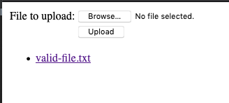
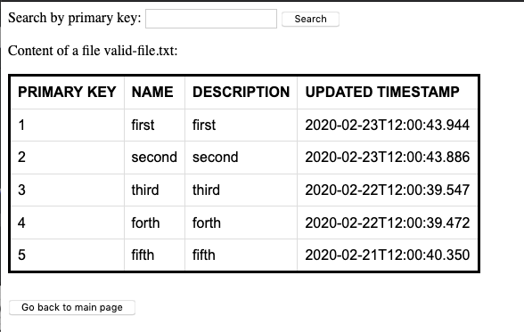
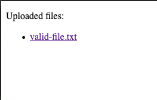
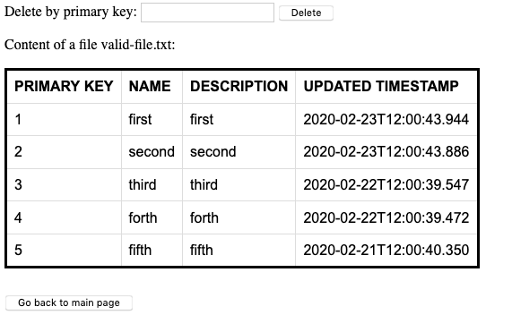

# luxoft-technical-task

## To start the application

* Copy this repository to your local machine
* Open project in some IDE tools and run the application from UploadingFilesApplication class 
    (src/com/luxoft/luxofttechnicaltask/UploadingFilesApplication.class)
* When application is run, you should go to any browser using this links:
    * for user staff [http://localhost:8080/user]
    * for admin staff [http://localhost:8080/admin]
    
During running the application, database will be created in root directory with two tables inside
    
## Functionality of application

### User:
* Main page - Upload files:
    * Select file with "Browser" button
    * Upload selected with "Upload"
    * If file is valid you should see it bellow
    

* Search files:
    * From main user page any file link and you will be redirected to a file content
    * Using a search box provide an item primary key, which you want to find
    * From this page you also have ability to go back to the main page
    

    
## Admin:
* Main page - All uploaded files:
    * Select file, which you want to open and you will be redirected to a file content 
    

* Deleting item from file by primary key:
    * Using a search box to provide an item primary key, which you want to delete
    * From this page you also have ability to go back to the main page
    

